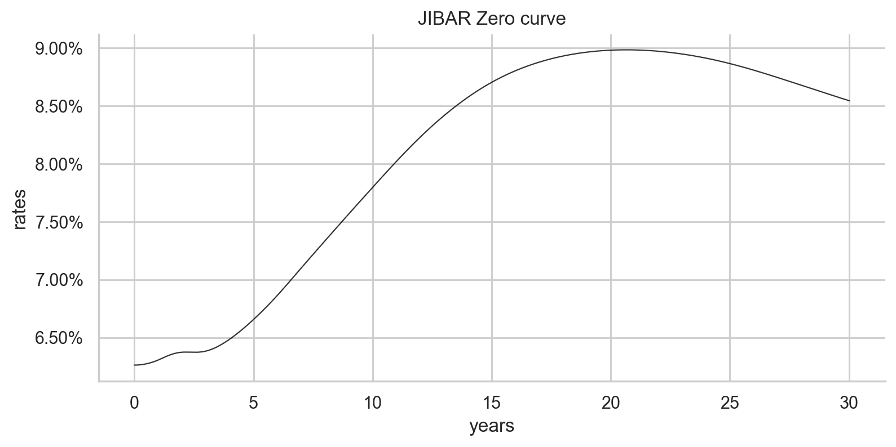
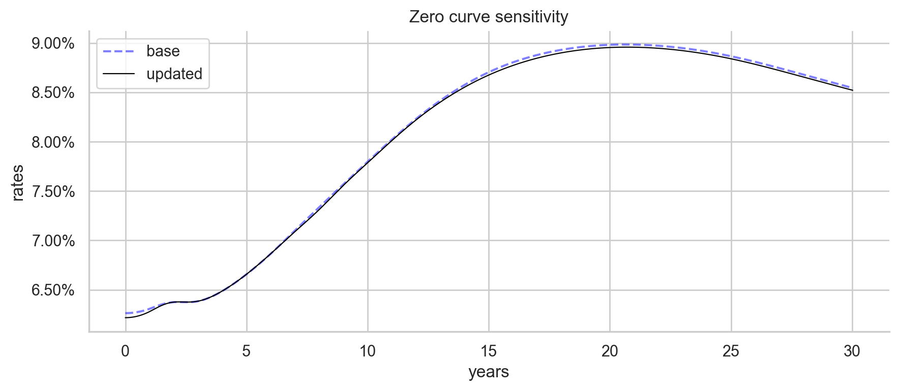

# Bootstrapping zero curve for ZAR swap rates
- $\textbf{Author}$: Patrick Mthisi
- $\textbf{Contact details}$: patrickmthisi@hotmail.com

# Project description and objectives:

In this short project, we derived zero rates from market ZAR swap rate quotes. Additionally, we implemented a methodology to accommodate jumps and track daily fluctuations in swap rates. Data was sourced from [BlueGamma](https://www.bluegamma.io/swap-rates/zar-swap-rates)

Below is the boostrapped JIBAR Zero curve:

A modified zero curve for market quote changes is shown below:

